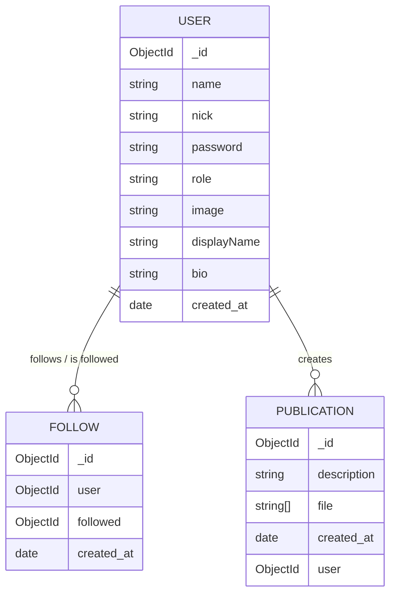

# 🌐 Api-Rest Red Social | Backend REST API

A RESTful API for a social media platform, built as an advanced full-stack project focused on backend architecture: authentication, ownership-based authorization, file uploads and a strongly-typed, scalable structure.


-lightgrey)

---

## ✨ Key Features

- **JWT Authentication:** Secure login flow with signed tokens (45min expiration) and a dedicated middleware that validates the `Bearer` token on every protected route.
- **Ownership-Based Authorization:** No admin/moderation roles — each user can only manage their own account, publications, and follows. Update/delete operations verify that the authenticated user matches the resource owner (401 if unauthenticated, 403 if authenticated but not the owner).
- **Complete CRUD Lifecycle:** Full create/read/update/delete flows across Users, Follows, and Publications, each with strict Zod validation on every request.
- **File Uploads with Multer:** Single image upload for user avatars and multiple image uploads (up to 5) for publications, with a `fileFilter` that rejects non-image files and a centralized error handler that catches upload errors.
- **Scalable Architecture:** Clear separation of concerns (Model → Service → Controller → Router) with reusable validation middleware and a custom `AppError` class for consistent error responses.

---

## 🛠️ Tech Stack

- **Node.js & TypeScript:** Strict type safety across the whole codebase.
- **Express 5:** REST routing and middleware pipeline.
- **MongoDB & Mongoose:** Schema modeling, population, and query logic.
- **Zod:** Request validation (body/params) on every endpoint.
- **bcrypt & jsonwebtoken:** Password hashing and JWT-based authentication.
- **Multer:** Multipart/form-data handling for image uploads.
- **pnpm:** Package management.
- **React (planned):** The frontend for this project is being built separately.

---

## 🗂️ Entity-Relationship Diagram



---

## 📡 Endpoints

### Auth

| Method | Route | Auth | Description |
|--------|-------|------|--------------|
| POST | `/api/auth/login` | ❌ | Authenticates a user by `nick` + `password`, returns a JWT |

### Users

| Method | Route | Auth | Description |
|--------|-------|------|--------------|
| POST | `/api/user/create` | ❌ | Registers a new user |
| GET | `/api/user/:id` | ❌ | Gets a user profile (includes follower/following counts) |
| PATCH | `/api/user/:id` | ✅ Owner | Updates profile data and/or avatar image |
| DELETE | `/api/user/:id` | ✅ Owner | Deletes the authenticated user's own account |

### Follows

| Method | Route | Auth | Description |
|--------|-------|------|--------------|
| GET | `/api/follow` | ❌ | Lists follow relationships |
| POST | `/api/follow` | ✅ | Follows another user (duplicate follows blocked by a unique index) |
| DELETE | `/api/follow/:id` | ✅ | Unfollows a user |

### Publications

| Method | Route | Auth | Description |
|--------|-------|------|--------------|
| GET | `/api/publication` | ❌ | Gets the general feed (all publications) |
| GET | `/api/publication/user/:id` | ❌ | Gets all publications from a specific user |
| GET | `/api/publication/:id` | ❌ | Gets a single publication by id |
| POST | `/api/publication/create` | ✅ | Creates a publication (description + up to 5 images) |
| PATCH | `/api/publication/:id` | ✅ Owner | Updates a publication (indirect ownership check) |
| DELETE | `/api/publication/:id` | ✅ Owner | Deletes a publication (indirect ownership check) |

---

## 📝 Scope & Technical Notes

- **No email / password recovery:** login is based on `nick` + `password` only. There's no email field or recovery flow — out of scope for this portfolio project.
- **`role` field without logic:** the `User` model includes a `role` field, but there's no real role-based authorization built on top of it. Authorization in this project is entirely ownership-based (a user can only manage their own resources). A full role/permission system is being covered separately in another course.
- **Express 5 typing change:** with Express 5, `req.params` values are typed as `string | string[]` instead of always `string` (a breaking change tied to `path-to-regexp` v8). Resolved with explicit `as string` casts at extraction points, keeping the pattern consistent across the codebase.
- **Indirect ownership on publications:** since the `:id` in publication routes refers to the publication (not the owner), update/delete first fetch the publication and then compare `publication.user._id` against the authenticated user's id.

---

## 💻 Getting Started

Clone the repository:

```bash
git clone https://github.com/Rapdev12/Master-en-React.git
cd "Master-en-React/16-Proyecto-SocialMedia/Api-Rest"
```

Install dependencies:

```bash
pnpm install
# or:
npm install
```

Set up your environment variables (create a `.env` file):

```
JWT_SECRET=your_secret_here
```

Run the development server:

```bash
pnpm dev
# or:
npm run dev
```

The API will be running at `http://localhost:3000`.

---

## 🤖 AI Collaboration & Development

This backend was built through a guided human-AI learning process with **Claude** as a technical mentor and pair-programmer — using guiding questions and hints rather than handing over ready-made code, so every architectural decision (ownership model, validation strategy, error handling, Multer configuration) was reasoned through, tested, and understood before being written. Each finished module went through a strict "team leader" style evaluation (no code, just reasoning: why this decision, what are the weak points), and a couple of unannounced knowledge quizzes were used along the way to confirm real understanding rather than memorization. Debugging sessions (like tracing the Multer 408 bug and the Express 5 typing issue) were done step by step, comparing evidence instead of guessing — grateful for the guidance along the way.

---

## 👤 Author

**Ronald Palacios**

- GitHub: [@Rapdev12](https://github.com/Rapdev12/Rapdev12)
- LinkedIn: [Ronald Palacios](https://www.linkedin.com/in/ronald-palacios-311a6b155/)
